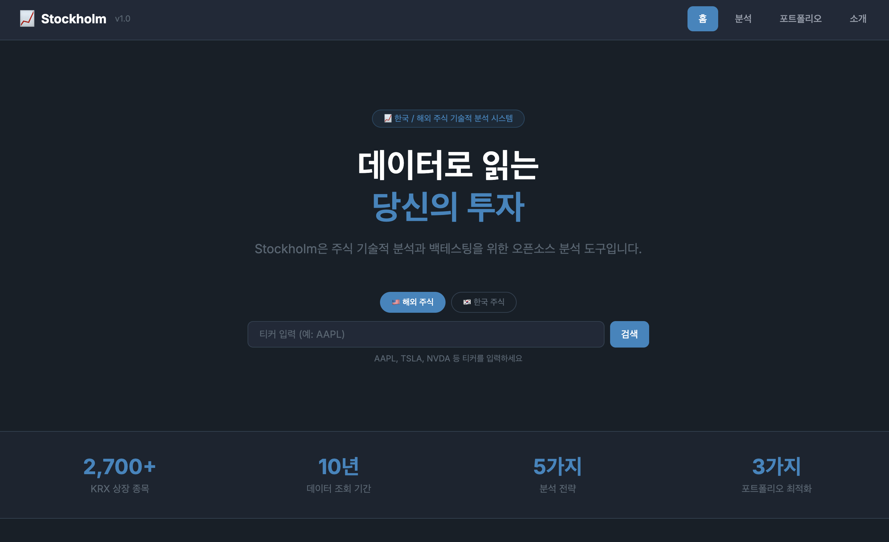
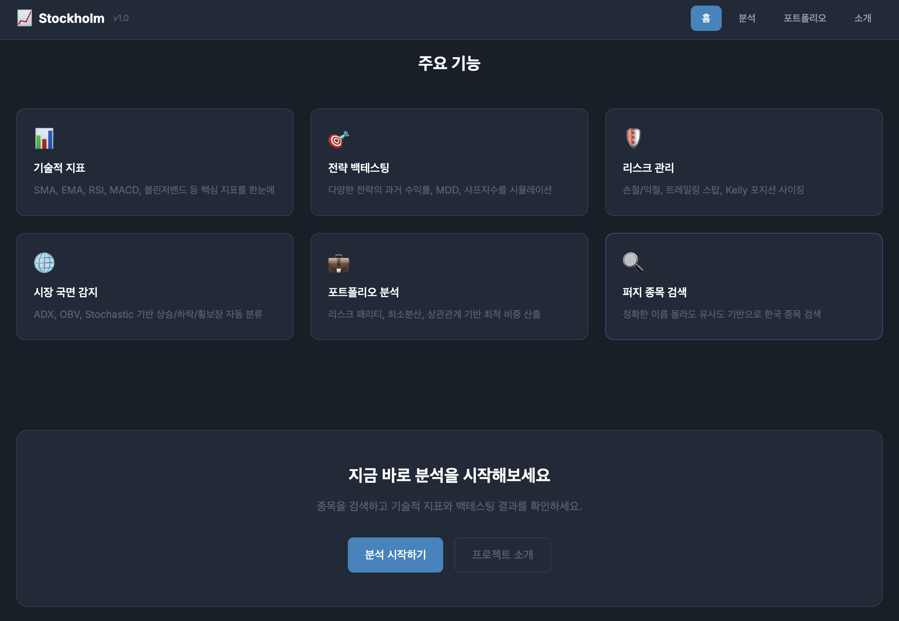
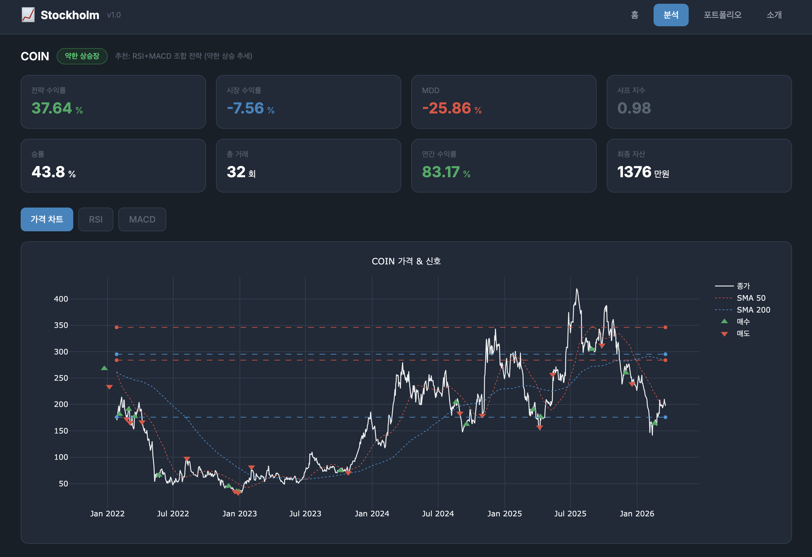
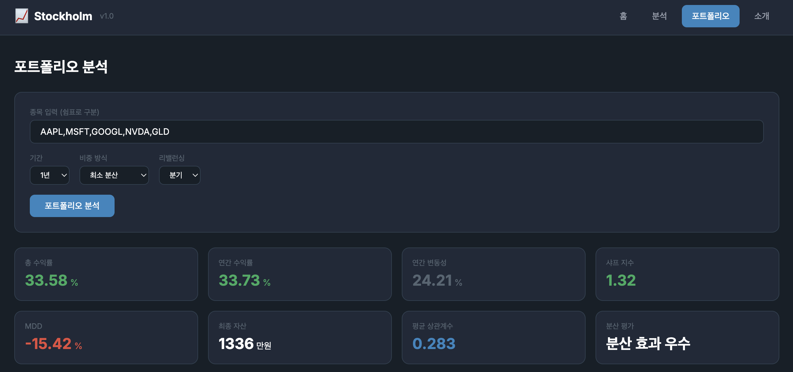
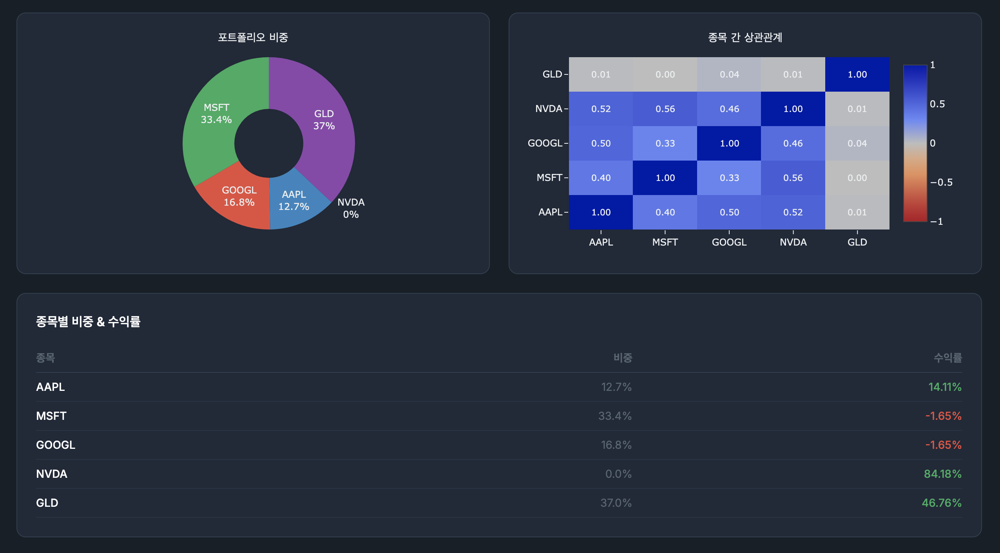

# 📈 Stockholm

> 당신의 투자 판단을 데이터로 — 한국/해외 주식 기술적 분석 & 백테스팅 시스템


---

## 📌 프로젝트 소개

Stockholm은 2022년에 작성된 주식 기술적 분석 스크립트를 **모듈화된 라이브러리 구조로 리팩토링**하고, **FastAPI + React 기반 웹 애플리케이션**으로 발전시킨 프로젝트입니다.

흩어져 있던 4개의 독립 스크립트(`SMA_EMA_Strategy_Automation.py`, `Trendline_Automation.py`, `SupportLine.py`, `ResistanceLine.py`)를 역할별 패키지로 재구성하고, 미완성이었던 백테스팅과 추가 지표를 완성했습니다.

**한국 주식(네이버 금융)** 과 **해외 주식(Yahoo Finance)** 을 모두 지원하며, 웹 애플리케이션 / CLI / Jupyter Notebook 세 가지 환경에서 사용할 수 있습니다.

| 항목 | 내용 |
|:---|:---|
| **버전** | v1.0.0 |
| **백엔드** | Python 3.13, FastAPI |
| **프론트엔드** | React 19, Vite, Tailwind CSS v4 |

---

## 🖥️ 스크린샷

### 홈
<p>
  
  
</p>

### 종목 분석


### 포트폴리오
<p>
  
  
</p>

---

## ✨ 주요 기능

### 데이터 수집
- KRX 상장기업 목록 자동 조회
- 네이버 금융 OHLCV 데이터 수집 (한국 주식, 약 10년치)
- Yahoo Finance OHLCV 데이터 수집 (해외 주식)
- **퍼지(Fuzzy) 종목명 검색** — 정확한 이름 몰라도 검색 가능

### 기술적 지표

| 지표 | 설명 |
|------|------|
| SMA | 단순 이동평균 (20, 50, 200일) |
| EMA | 지수 이동평균 (12, 26, 50, 200일) |
| RSI | 상대강도지수 — 과매수/과매도 판단 |
| MACD | 이동평균 수렴/발산 — 모멘텀 측정 |
| 볼린저밴드 | 변동성 기반 밴드 — 돌파/수축 신호 |
| ADX | 추세 강도 측정 |
| OBV | 거래량 기반 매집/분산 감지 |
| Stochastic | 단기 과매수/과매도 (RSI보다 빠른 선행 지표) |

### 패턴 분석
- **HDBSCAN 클러스터링** 기반 지지선/저항선 자동 탐지
- **argrelextrema** 기반 추세선 (고점/저점 연결)
- 슬라이딩 윈도우 피벗 포인트 탐지

### 전략 & 백테스팅

| 전략 | 설명 |
|------|------|
| SMA / EMA 크로스 | 골든크로스·데드크로스 기반 매수/매도 |
| SMA-EMA 크로스 | 단기 SMA와 EMA 교차 전략 |
| RSI + MACD 조합 | 과매도 + 상승 모멘텀 동시 확인 |
| Bollinger + RSI 조합 | 밴드 터치 + 과매수/과매도 확인 |

- 수익률, 연간수익률, MDD, 승률, 샤프지수 리포트
- 전략 비교 (여러 전략 동시 비교)
- Buy & Hold 대비 성과 비교

### 시장 국면 감지
- ADX, OBV, Stochastic 기반 **종합 regime_score** 계산
- `bull` / `weak_bull` / `bear` / `weak_bear` / `range` 5단계 분류
- 국면별 최적 전략 자동 추천

### 리스크 관리
- 손절선 / 익절선 (Stop Loss / Take Profit)
- 트레일링 스탑 (활성화 임계값 포함)
- Kelly 공식 기반 포지션 사이징 (안전 밴드 적용)
- 청산 원인별 리포트 (손절 / 익절 / 트레일링 / 신호)

### 포트폴리오 전략
- 동일 비중 / 리스크 패리티 / 최소 분산 포트폴리오
- 종목 간 상관관계 분석 (전체 + 롤링)
- 리밸런싱 지원 (월별 / 분기 / 연간)
- 포트폴리오 성과 리포트 (수익률, 변동성, 샤프, MDD)

---

## 🗂️ 프로젝트 구조

```
stockholm/
├── api/                         # FastAPI 백엔드
│   ├── main.py                  # 앱 진입점
│   ├── routers/
│   │   ├── stocks.py            # 종목 검색 / 시세
│   │   ├── analysis.py          # 지표 / 패턴
│   │   ├── strategy.py          # 전략 신호
│   │   ├── backtest.py          # 백테스팅
│   │   └── portfolio.py         # 포트폴리오
│   ├── schemas.py               # Pydantic 모델
│   └── dependencies.py          # KRX 캐싱 등
│
├── frontend/                    # React 프론트엔드
│   └── src/
│       ├── pages/               # Home, Analysis, Portfolio, About
│       ├── components/          # SearchBar, StatCard, RegimeBadge 등
│       └── api/client.js        # axios API 클라이언트
│
├── data/
│   ├── krx_fetcher.py           # KRX + 네이버 금융
│   └── yahoo_fetcher.py         # Yahoo Finance
├── analysis/
│   ├── indicators.py            # 기술적 지표
│   ├── patterns.py              # 지지/저항선, 추세선
│   ├── backtester.py            # 백테스팅
│   ├── market_regime.py         # 시장 국면 감지
│   └── risk.py                  # 리스크 관리
├── strategy/
│   ├── base.py                  # 전략 추상 클래스
│   ├── ma_crossover.py          # SMA/EMA 크로스
│   ├── combined.py              # 조합 전략
│   └── portfolio.py             # 포트폴리오 전략
├── visualization/
│   └── plotter.py               # 통합 시각화 (matplotlib)
├── utils/
│   └── search.py                # 퍼지 종목명 검색
├── main.py                      # CLI 진입점
├── notebook.ipynb               # Jupyter 대화형 분석
└── requirements.txt
```

---

## 🚀 시작하기

### 요구사항
- Python 3.11 이상
- Node.js 18 이상
- macOS / Windows / Linux

### 설치

```bash
git clone https://github.com/robincooding/stockholm.git
cd stockholm
python3 -m venv .venv
source .venv/bin/activate  # Windows: .venv\Scripts\activate
pip install -r requirements.txt
```

### 웹 애플리케이션 실행

백엔드와 프론트엔드를 각각 실행해주세요.

**터미널 1 — FastAPI 백엔드:**
```bash
uvicorn api.main:app --reload
# http://localhost:8000
# Swagger UI: http://localhost:8000/docs
```

**터미널 2 — React 프론트엔드:**
```bash
cd frontend
npm install
npm run dev
# http://localhost:3001
```

### CLI 실행

```bash
python main.py
```

```
╔══════════════════════════════════════╗
║         📈  Stockholm v1.0          ║
║   기술적 분석 & 백테스팅 시스템      ║
╚══════════════════════════════════════╝

  [1] 한국 주식 분석 (네이버 금융)
  [2] 해외 주식 분석 (Yahoo Finance)
  [0] 종료
```

### Jupyter Notebook 실행

```bash
jupyter notebook
```

---

## 🔌 API 엔드포인트

| 메서드 | 경로 | 설명 |
|--------|------|------|
| GET | `/stocks/search` | 한국 주식 퍼지 검색 |
| POST | `/stocks/ohlcv` | OHLCV 데이터 조회 |
| POST | `/stocks/regime` | 시장 국면 조회 |
| POST | `/analysis/indicators` | 기술적 지표 계산 |
| POST | `/analysis/patterns` | 지지/저항선, 추세선 |
| POST | `/strategy/signals` | 전략 매수/매도 신호 |
| POST | `/backtest/run` | 백테스팅 실행 |
| POST | `/backtest/compare` | 전략 비교 |
| POST | `/portfolio/analyze` | 포트폴리오 상관관계 분석 |
| POST | `/portfolio/backtest` | 포트폴리오 백테스팅 |

> 전체 API 문서: `http://localhost:8000/docs`

---

## 📊 사용 예시

### 한국 주식 분석

```python
from data.krx_fetcher import fetch_krx_list, get_korean_stock
from utils.search import fuzzy_search_company

krx = fetch_krx_list()
results = fuzzy_search_company("삼성전", krx)
df = get_korean_stock("삼성전자", krx)
```

### 지표 조합 전략 + 리스크 관리

```python
from data.yahoo_fetcher import get_us_stock
from strategy.combined import RSIMACDStrategy
from analysis.backtester import Backtester
from analysis.risk import apply_stop_loss_take_profit, risk_report

df = get_us_stock("AAPL", years=5)
strategy = RSIMACDStrategy()
df_signals = strategy.generate_signals(df)
df_signals = apply_stop_loss_take_profit(df_signals, stop_loss=0.05, take_profit=0.15)

bt = Backtester(initial_capital=10_000_000)
bt.run(df_signals)
bt.print_report()
risk_report(df_signals, stop_loss=0.05, take_profit=0.15)
```

### 시장 국면 감지

```python
from analysis.market_regime import detect_market_regime, get_regime_summary

df = detect_market_regime(df)
summary = get_regime_summary(df)
print(f"현재 국면: {summary['current_regime']}")
print(f"추천 전략: {summary['recommended']}")
```

### 포트폴리오 분석

```python
from strategy.portfolio import (
    build_price_matrix, risk_parity_weight,
    backtest_portfolio, portfolio_report
)

data = {t: get_us_stock(t, years=3) for t in ['AAPL', 'MSFT', 'GOOGL', 'NVDA', 'GLD']}
price_matrix = build_price_matrix(data)
weights = risk_parity_weight(price_matrix)
result = backtest_portfolio(data, weights, rebalance_freq='quarterly')
portfolio_report(result, weights)
```

---

## 📦 패키지 목록

| 패키지 | 버전 | 용도 |
|--------|------|------|
| pandas | ≥ 2.2 | 데이터프레임 처리 |
| numpy | ≥ 1.25 | 수치 계산 |
| requests | ≥ 2.31 | HTTP 요청 |
| yfinance | ≥ 0.2 | Yahoo Finance |
| scikit-learn | ≥ 1.6 | 데이터 스케일링 |
| hdbscan | ≥ 0.8 | 지지/저항선 클러스터링 |
| scipy | ≥ 1.11 | 신호 처리 / 포트폴리오 최적화 |
| matplotlib | ≥ 3.7 | 시각화 (CLI / Notebook) |
| rapidfuzz | ≥ 3.0 | 퍼지 검색 |
| fastapi | ≥ 0.100 | REST API 백엔드 |
| uvicorn | ≥ 0.20 | ASGI 서버 |
| jupyter | ≥ 1.0 | Notebook 환경 |

---

## 🗺️ 로드맵

- [x] Phase 1 — 데이터 수집 + 퍼지 검색
- [x] Phase 2 — 기술적 지표 + 패턴 분석
- [x] Phase 3 — 전략 + 백테스팅
- [x] Phase 4 — 시각화 + CLI + Notebook
- [x] Phase 5 — 지표 조합 전략 + 시장 국면 감지 + 리스크 관리 + 포트폴리오
- [x] Phase 6 — FastAPI + React 웹 애플리케이션

---

## 📄 라이선스

MIT License
